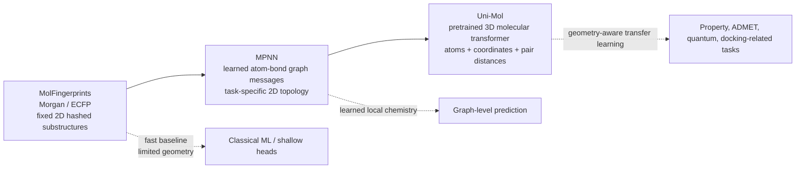
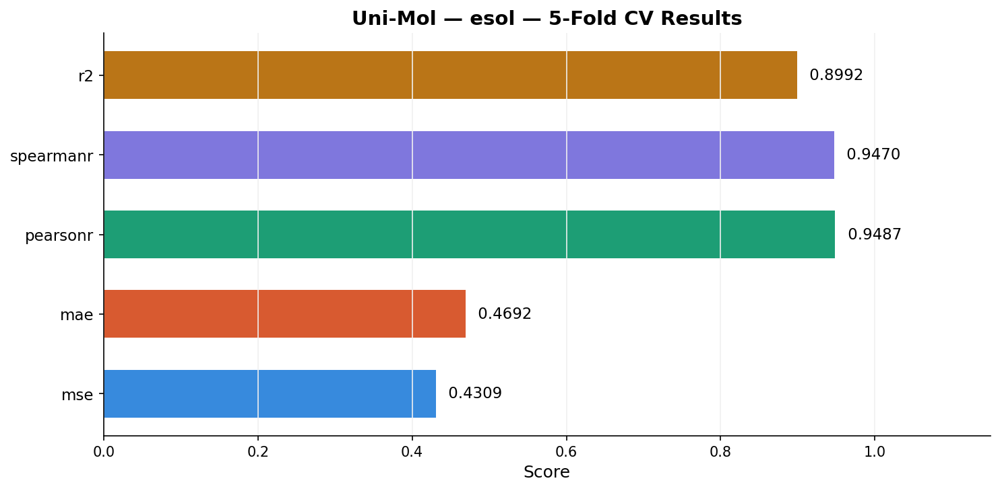
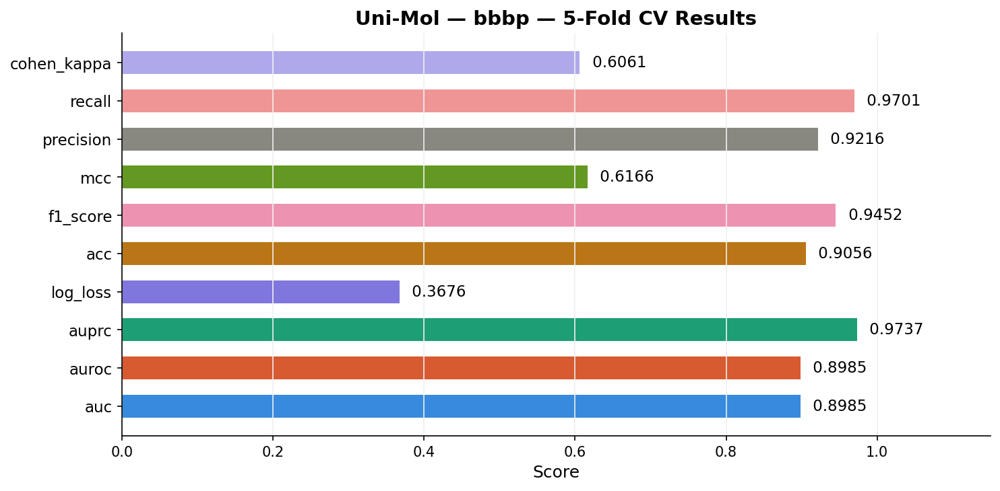
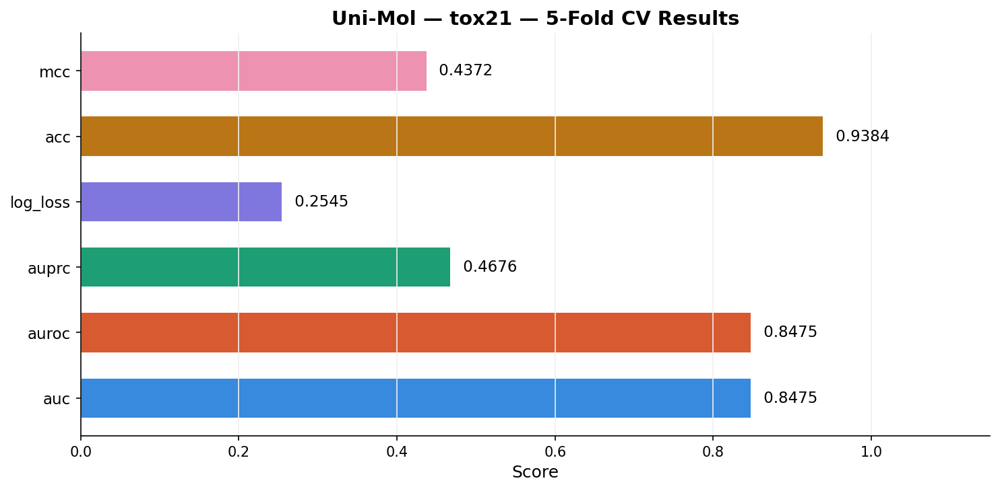
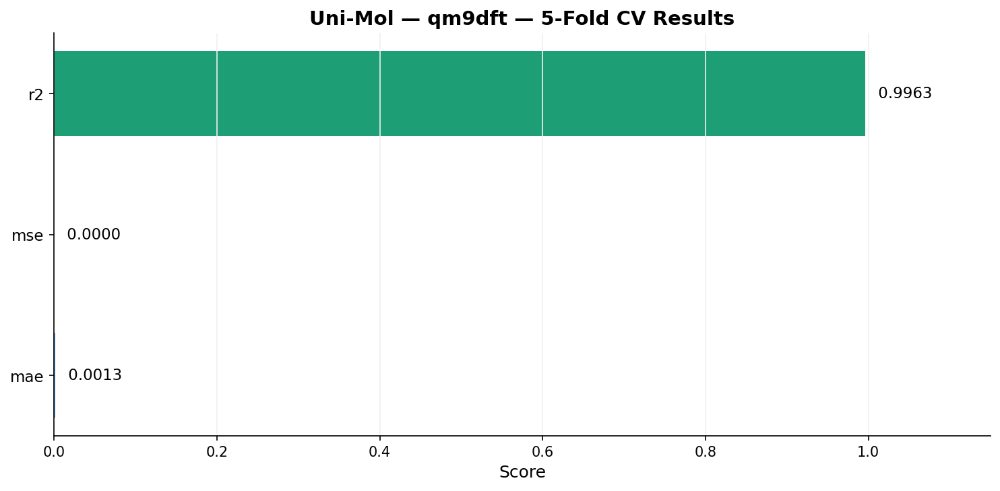

# Uni-Mol Molecular Property Prediction Poster Summary

## Title / 标题

**English:** Fine-tuning Uni-Mol Tools for Multi-task Molecular Property Prediction  
**中文：** 基于 Uni-Mol Tools 的多任务分子属性预测微调

---

## Introduction / 研究背景

**English:**  
Accurate molecular property prediction is important for drug discovery, toxicology screening, and computational chemistry because it can reduce the cost of experimental measurement and high-throughput simulation. Traditional molecular machine learning methods often rely on handcrafted descriptors or 2D molecular graphs, which may miss important 3D geometric information. Uni-Mol is a molecular representation learning framework that uses molecular structure and 3D conformer information to learn transferable representations for downstream property prediction tasks.

In this project, I used the lightweight `unimol_tools` workflow to fine-tune Uni-Mol on four benchmark molecular property prediction tasks: ESOL, BBBP, Tox21, and QM9DFT. These tasks cover regression, binary classification, multi-label classification, and quantum chemical property prediction.

**中文：**  
准确预测分子属性对于药物发现、毒性筛选和计算化学具有重要意义，因为它可以降低实验测量和高通量模拟的成本。传统分子机器学习方法通常依赖人工设计的分子描述符或二维分子图，可能忽略重要的三维构象信息。Uni-Mol 是一种面向分子的表示学习框架，能够利用分子结构和 3D 构象信息学习可迁移的分子表征，并用于下游属性预测任务。

本项目使用轻量化的 `unimol_tools` 流程，在 ESOL、BBBP、Tox21 和 QM9DFT 四个分子属性预测基准任务上微调 Uni-Mol。这些任务覆盖回归、二分类、多标签分类和量子化学属性预测。

---

## Methods / 方法

**English:**  
The official molecular property prediction dataset package was prepared locally and converted from LMDB format into CSV files. Each CSV file contained molecular SMILES strings and corresponding target property labels. The model was trained using `unimol_tools.MolTrain` with the Uni-Mol molecular model and 5-fold cross-validation. Molecular conformers were generated and cached before training. Evaluation metrics were selected according to task type: regression tasks used MSE, MAE, Pearson's r, Spearman's r, and R2; classification tasks used AUC, AUPRC, Accuracy, F1, Precision, Recall, MCC, Kappa, and Log Loss where applicable.

**中文：**  
首先在本地准备官方 molecular property prediction 数据集，并将 LMDB 格式转换为 CSV 格式。每个 CSV 文件包含分子 SMILES 字符串及对应的目标属性标签。模型训练使用 `unimol_tools.MolTrain` 和 Uni-Mol 分子模型，并采用 5 折交叉验证。训练前自动生成并缓存分子构象。评估指标根据任务类型选择：回归任务使用 MSE、MAE、Pearson 相关系数、Spearman 相关系数和 R2；分类任务根据需要使用 AUC、AUPRC、Accuracy、F1、Precision、Recall、MCC、Kappa 和 Log Loss。

**Workflow / 实验流程：**

1. Download and extract `molecular_property_prediction.tar.gz`.
2. Convert LMDB datasets to CSV files using `scripts/1_convert_lmdb_to_csv.py`.
3. Train benchmark tasks with Uni-Mol Tools using `scripts/2_train.py` or `scripts/3_train_all.py`.
4. Save fold models, configurations, metrics, and visualization artifacts.
5. Summarize task-level performance using the latest results under `output/`.

**实验流程中文说明：**

1. 下载并解压 `molecular_property_prediction.tar.gz`。
2. 使用 `scripts/1_convert_lmdb_to_csv.py` 将 LMDB 数据转换为 CSV。
3. 使用 `scripts/2_train.py` 或 `scripts/3_train_all.py` 调用 Uni-Mol Tools 训练基准任务。
4. 保存交叉验证模型、配置文件、评估指标和可视化结果。
5. 根据 `output/` 文件夹中的最新结果汇总各任务表现。

---

## Model Context / 模型关系与技术栈改进

**English:**  
MolFingerprints, MPNN, and Uni-Mol can be understood as three generations of molecular representation methods. MolFingerprints such as Morgan/ECFP convert a molecule into a fixed-length binary or count vector by hashing circular 2D substructures. This is fast, stable, and effective for similarity search or classical machine learning, but it cannot learn task-specific representations and does not use 3D conformers.

MPNN improves on fingerprints by treating molecules as graphs and learning atom/bond representations end-to-end. Local chemical environments are propagated through message passing, then aggregated into a molecular embedding for prediction. Compared with fixed fingerprints, MPNN can adapt features to the target task and capture richer topological patterns, but standard MPNNs are still mostly based on 2D connectivity and may need extra engineering to model long-range or geometric effects.

Uni-Mol further upgrades the stack from learned 2D graph features to pretrained 3D molecular representation learning. It uses atom tokens, 3D coordinates, atom-pair distances, distance-aware attention, and task-specific prediction heads. Large-scale 3D pretraining gives the downstream model stronger geometric priors and better data efficiency, which is especially helpful for solubility, BBB permeability, and quantum chemical properties where molecular shape, distance, and conformation matter.

**中文：**  
MolFingerprints、MPNN 和 Uni-Mol 可以理解为三代分子表征方法。MolFingerprints（如 Morgan/ECFP）通过哈希二维圆形子结构，将分子转换为固定长度的二进制或计数向量。这类方法速度快、稳定，适合相似性搜索和传统机器学习，但特征是预定义的，不能根据任务自动学习，也不直接利用 3D 构象。

MPNN 相比指纹方法的改进在于将分子视为图结构，并通过端到端训练学习原子和化学键表示。局部化学环境通过 message passing 逐层传播，最后聚合成分子级表示用于预测。相比固定指纹，MPNN 能够根据目标任务自适应学习特征，并捕捉更丰富的拓扑模式，但标准 MPNN 主要依赖二维连接关系，对于长程相互作用和三维几何信息通常还需要额外设计。

Uni-Mol 则进一步将技术栈从二维图表征升级到预训练的三维分子表征学习。它同时使用原子 token、3D 坐标、原子对距离、距离感知注意力机制和任务预测头。大规模 3D 预训练为下游任务提供了更强的几何先验和更好的数据效率，因此更适合溶解度、血脑屏障穿透性和量子化学属性等受分子形状、空间距离和构象影响明显的问题。



| Model family / 模型 | Input representation / 输入表示 | Technical stack / 技术栈 | Main limitation / 主要限制 | Improvement toward our tasks / 对本项目问题的提升 |
|---|---|---|---|---|
| MolFingerprints / 分子指纹 | 2D circular substructures hashed into fixed vectors / 二维圆形子结构哈希为固定向量 | RDKit/Morgan/ECFP + classical ML or MLP / RDKit、Morgan/ECFP 与传统机器学习或 MLP | Fixed descriptors, hash collisions, no conformer geometry / 固定描述符、存在哈希碰撞、不利用构象几何 | Good baseline for similarity and simple QSAR, but less expressive for geometry-sensitive properties / 可作为相似性与简单 QSAR 基线，但对几何敏感属性表达不足 |
| MPNN | Molecular graph with atoms and bonds / 原子-化学键分子图 | Graph neural network, message passing, readout, prediction head / 图神经网络、消息传递、读出层、预测头 | Usually local and topology-centered; 3D information is optional / 通常偏局部和拓扑结构，3D 信息不是默认核心输入 | Learns task-specific chemical patterns for BBBP and toxicity better than fixed fingerprints / 比固定指纹更能学习 BBBP 和毒性任务中的任务相关结构模式 |
| Uni-Mol | Atom tokens, 3D coordinates, pairwise distances / 原子 token、三维坐标、原子对距离 | 3D-aware pretrained transformer, distance-aware attention, task heads / 三维感知预训练 Transformer、距离感知注意力、任务预测头 | Requires conformer generation and larger model resources / 需要构象生成和更高模型资源 | Stronger geometry-aware representation for ESOL and QM9DFT; better transfer when labels are limited / 对 ESOL 和 QM9DFT 提供更强几何表征，在标签有限时迁移能力更好 |

**Focused problem improvement / 面向本项目问题的提升：**

- ESOL: Uni-Mol can use 3D conformer information to better represent polarity, molecular shape, and intermolecular interaction tendencies, which helps explain its strong solubility performance.
- BBBP: MPNN and Uni-Mol both improve over fixed fingerprints by learning task-specific chemical patterns; Uni-Mol additionally captures spatial structure related to permeability.
- Tox21: The main bottleneck is severe multi-label imbalance rather than only representation quality, so Uni-Mol improves representation capacity but still needs weighted loss, sampling, or calibration.
- QM9DFT: Quantum chemical properties are strongly geometry-dependent, so Uni-Mol's 3D distance-aware representation is a clearer technical match than 2D fingerprints or ordinary 2D MPNNs.

**聚焦任务提升中文说明：**

- ESOL：Uni-Mol 能利用 3D 构象更好表示极性、分子形状和分子间相互作用倾向，因此有助于解释其较强的溶解度预测表现。
- BBBP：MPNN 和 Uni-Mol 都比固定指纹更能学习任务相关化学模式；Uni-Mol 进一步引入与穿透性相关的空间结构信息。
- Tox21：主要瓶颈是严重多标签类别不平衡，而不仅是表征能力不足；Uni-Mol 提升了表征容量，但仍需要加权损失、采样或概率校准。
- QM9DFT：量子化学属性高度依赖几何结构，因此 Uni-Mol 的 3D 距离感知表征比二维指纹或普通二维 MPNN 更契合该任务。

---

## Results / 结果

**English:**  
The latest results show that Uni-Mol performed strongly on ESOL and QM9DFT, achieved good classification performance on BBBP, and showed limited performance on the more difficult Tox21 multi-label toxicity task. QM9DFT achieved the best overall regression performance with Pearson's r = 0.9804 and R2 = 0.9605. ESOL also showed strong solubility prediction performance with Pearson's r = 0.9487 and R2 = 0.8992. BBBP reached AUC = 0.8985, indicating good discrimination between blood-brain barrier permeable and non-permeable molecules. Tox21 had high apparent accuracy, but its AUC = 0.6475 and MCC = 0.3306 indicate that toxicity prediction remains challenging under severe label imbalance.

**中文：**  
最新结果显示，Uni-Mol 在 ESOL 和 QM9DFT 上表现优秀，在 BBBP 二分类任务上表现良好，但在更困难的 Tox21 多标签毒性预测任务上表现偏弱。QM9DFT 的整体回归性能最好，Pearson 相关系数达到 0.9804，R2 达到 0.9605。ESOL 的溶解度预测也表现稳定，Pearson 相关系数为 0.9487，R2 为 0.8992。BBBP 的 AUC 达到 0.8985，说明模型能够较好地区分可穿透和不可穿透血脑屏障的分子。Tox21 虽然表面准确率较高，但 AUC = 0.6475、MCC = 0.3306，说明在严重类别不平衡的多标签毒性任务中仍然具有较大挑战。

| Task / 任务 | Type / 类型 | Key metric / 核心指标 | Main result / 主要结果 | Evaluation / 综合评价 |
|---|---|---:|---|---|
| ESOL | Solubility regression / 溶解度回归 | Pearson r = 0.9487 | R2 = 0.8992, MAE = 0.4692 | Excellent / 优秀 |
| BBBP | Binary classification / 血脑屏障二分类 | AUC = 0.8985 | F1 = 0.9452, Accuracy = 0.9056 | Good / 良好 |
| Tox21 | Multi-label toxicity classification / 多标签毒性分类 | AUC = 0.6475 | Accuracy = 0.9624, MCC = 0.3306 | Weak under imbalance / 不平衡数据下偏弱 |
| QM9DFT | Quantum property regression / 量子化学属性回归 | Pearson r = 0.9804 | R2 = 0.9605, MAE = 0.0024 | Excellent / 优秀 |

### ESOL / 溶解度预测

| Metric / 指标 | Value / 数值 | Interpretation / 含义 |
|---|---:|---|
| MSE | 0.4309 | Lower is better; average squared prediction error. / 越低越好，表示平均平方误差。 |
| MAE | 0.4692 | Average absolute error is about 0.47 log units. / 平均绝对误差约为 0.47 个 log 单位。 |
| Pearson's r | 0.9487 | Strong linear correlation. / 线性相关性很强。 |
| Spearman's r | 0.9470 | Strong rank correlation. / 排序相关性很强。 |
| R2 | 0.8992 | The model explains about 89.9% of target variance. / 模型解释约 89.9% 的目标方差。 |



### BBBP / 血脑屏障穿透性预测

| Metric / 指标 | Value / 数值 | Interpretation / 含义 |
|---|---:|---|
| AUC / AUROC | 0.8985 | Good discrimination ability. / 分类区分能力良好。 |
| AUPRC | 0.9737 | Strong precision-recall performance. / 精确率-召回率表现很强。 |
| Accuracy | 0.9056 | 90.6% of predictions are correct. / 约 90.6% 的预测正确。 |
| F1-Score | 0.9452 | Balanced precision and recall are high. / 精确率和召回率综合表现优秀。 |
| Precision | 0.9216 | Most predicted permeable molecules are correct. / 预测为可穿透的分子大多正确。 |
| Recall | 0.9701 | Most truly permeable molecules are recovered. / 大多数真实可穿透分子被识别。 |
| MCC | 0.6166 | Moderate consistency under imbalance. / 在类别不平衡下达到中等一致性。 |
| Cohen's Kappa | 0.6061 | Moderate agreement beyond chance. / 去除随机因素后达到中等一致。 |
| Log Loss | 0.3676 | Probability prediction quality is reasonable. / 概率预测质量较好。 |



### Tox21 / 多标签毒性预测

| Metric / 指标 | Value / 数值 | Interpretation / 含义 |
|---|---:|---|
| AUC / AUROC | 0.6475 | Only moderately above random guessing. / 仅略高于随机水平。 |
| AUPRC | 0.2377 | Low under severe class imbalance. / 在严重类别不平衡下较低。 |
| Accuracy | 0.9624 | High but misleading because most labels are negative. / 数值较高但有迷惑性，因为多数标签为阴性。 |
| MCC | 0.3306 | Weak-to-moderate multi-label correlation. / 多标签综合相关性偏弱。 |
| Log Loss | 0.4888 | Probability calibration still needs improvement. / 概率校准仍需改进。 |



### QM9DFT / 量子化学属性预测

| Metric / 指标 | Value / 数值 | Interpretation / 含义 |
|---|---:|---|
| MSE | ~0.0000 | Very small due to the scale of quantum targets. / 由于量子化学属性量纲较小，均方误差接近零。 |
| MAE | 0.0024 | Very low average prediction error. / 平均预测误差很低。 |
| Pearson's r | 0.9804 | Extremely strong linear correlation. / 极强线性相关。 |
| Spearman's r | 0.9788 | Extremely strong rank correlation. / 极强排序相关。 |
| R2 | 0.9605 | The model explains about 96.0% of target variance. / 模型解释约 96.0% 的目标方差。 |



---

## Poster Takeaway / Poster 结论

**English:**  
Fine-tuning Uni-Mol Tools produced strong performance on molecular regression tasks, especially QM9DFT and ESOL, and good performance on BBBP binary classification. Tox21 remained challenging because of multi-label toxicity complexity and severe class imbalance. Overall, the results show that Uni-Mol's 3D molecular representations are highly effective for structure-property prediction, while difficult imbalanced toxicity tasks may require additional loss weighting, sampling strategies, or longer training.

**中文：**  
使用 Uni-Mol Tools 微调后，模型在分子回归任务上表现突出，尤其是 QM9DFT 和 ESOL；在 BBBP 二分类任务上也取得了良好效果。Tox21 由于多标签毒性机制复杂且类别严重不平衡，仍然是较具挑战的任务。总体来看，结果表明 Uni-Mol 的 3D 分子表征能够有效支持结构-属性预测，而复杂不平衡毒性任务可能需要进一步引入加权损失、采样策略或更长训练。

**Performance ranking / 性能排序：**

```text
QM9DFT (r = 0.9804) > ESOL (r = 0.9487) > BBBP (AUC = 0.8985) > Tox21 (AUC = 0.6475)
```

---

## Local Evidence / 本地结果依据

- Latest analysis report: `output/UniMol训练结果分析报告.md`
- PDF report: `output/UniMol训练结果分析报告.pdf`
- ESOL chart: `output/esol_metrics_chart.png`
- BBBP chart: `output/bbbp_metrics_chart.png`
- Tox21 chart: `output/tox21_metrics_chart.png`
- QM9DFT chart: `output/qm9dft_metrics_chart.png`
- Training scripts: `Uni-Mol-Training-Project/scripts/2_train.py`, `Uni-Mol-Training-Project/scripts/3_train_all.py`
- Dataset CSV files: `Uni-Mol-Training-Project/csv_data/`
- Model checkpoints: `Uni-Mol-Training-Project/checkpoints/`

---

## Usable Figure Candidates / 可用图片候选

These figures are suitable for a poster after adding source attribution. For safest reuse, prefer the local result charts and the Mermaid diagram above; use external paper figures with citation and license/permission checks required by your course or venue.

以下图片适合在 poster 中作为素材，并应保留来源标注。最稳妥的做法是优先使用本地结果图和上方 Mermaid 对比图；外部论文图建议按课程或会议要求检查版权与引用格式。

| Purpose / 用途 | Figure / 图片 | Source / 来源 | Suggested use / 建议用法 |
|---|---|---|---|
| Uni-Mol architecture / Uni-Mol 架构 | Uni-Mol paper figures / Uni-Mol 论文图 | OpenReview: https://openreview.net/forum?id=IfFZr1gl0b | Use to show 3D molecular pretraining and geometry-aware representation. / 展示 3D 分子预训练与几何表征。 |
| Uni-Mol implementation details / Uni-Mol 实现细节 | Uni-Mol model architecture notes / Uni-Mol 模型结构说明 | DeepWiki summary of deepmodeling/Uni-Mol: https://deepwiki.com/deepmodeling/Uni-Mol/3.1-model-architecture | Use as technical reference for atom tokens, pair distances, Gaussian distance encoding, and task heads. / 用作原子 token、距离编码和任务头的技术依据。 |
| MPNN / D-MPNN architecture / MPNN 架构 | Chemprop Figure 1 architecture / Chemprop 图 1 架构 | PMC article page: https://pmc.ncbi.nlm.nih.gov/articles/PMC10777403/ | Use to explain message passing, graph readout, and prediction head. / 解释消息传递、图读出和预测头。 |
| Morgan/ECFP fingerprint / Morgan 指纹 | ECFP generation Figure 2 / ECFP 生成示意图 | PMC article page: https://pmc.ncbi.nlm.nih.gov/articles/PMC8769696/ | Use to show circular substructure hashing and fixed bit-vector fingerprints. / 展示圆形子结构哈希和固定长度 bit vector。 |
| Local benchmark results / 本地训练结果 | ESOL, BBBP, Tox21, QM9DFT metric charts / 四个任务指标图 | `output/*_metrics_chart.png` | Use directly in the poster result section. / 可直接用于 poster 结果部分。 |

---

## References / 参考资料

- Uni-Mol GitHub repository: https://github.com/deepmodeling/Uni-Mol
- Uni-Mol OpenReview paper page: https://openreview.net/forum?id=IfFZr1gl0b
- Uni-Mol model architecture notes: https://deepwiki.com/deepmodeling/Uni-Mol/3.1-model-architecture
- Chemprop / D-MPNN paper page: https://pmc.ncbi.nlm.nih.gov/articles/PMC10777403/
- ECFP fingerprint documentation: https://scikit-fingerprints.readthedocs.io/latest/modules/generated/skfp.fingerprints.ECFPFingerprint.html
- Morgan/ECFP figure source: https://pmc.ncbi.nlm.nih.gov/articles/PMC8769696/
- Local project guide: `Uni-Mol-Training-Project/README.md`
- Local training guide: `Uni-Mol-Training-Project/TRAINING_GUIDE.md`
